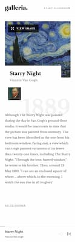

# Frontend Mentor - Galleria slideshow site solution

This is a solution to the [Galleria slideshow site challenge on Frontend Mentor](https://www.frontendmentor.io/challenges/galleria-slideshow-site-tEA4pwsa6). Frontend Mentor challenges help you improve your coding skills by building realistic projects.

## Table of contents

- [Overview](#overview)
- [The challenge](#the-challenge)
- [Screenshot](#screenshot)
- [Links](#links)
- [Built with](#built-with)
- [What I learned](#what-i-learned)
- [Author](#author)

## Overview

### The challenge

Users should be able to:

- View the optimal layout for the app depending on their device's screen size
- See hover states for all interactive elements on the page
- Navigate the slideshow and view each painting in a lightbox

### Screenshot

### Links

- Solution URL: [GitHub](https://github.com/orphandeity/galleria-slideshow-site.git)
- Live Site URL: [Vercel](https://galleria-slideshow-site-amber.vercel.app/)

### Built with

- [React](https://reactjs.org/) - JS library
- [Next.js](https://nextjs.org/) - React framework
- [TailwindCSS](https://tailwindcss.com/) - For styles
- [Framer Motion](https://www.framer.com/motion/) - Animation

### What I learned

This project presented some unexpected challenges, mostly having to do with the masonry layout. I managed to create a javascript solution that sorts the data into columns and then styled with a comination of flex-box and grid. This gave me a much better understanding and appreciation of how "Pinterest" style layouts are made.

### Author

- Frontend Mentor - [@orphandeity](https://www.frontendmentor.io/profile/orphandeity)
- GitHub - [@orphandeity](https://www.github.com/orphandeity)
